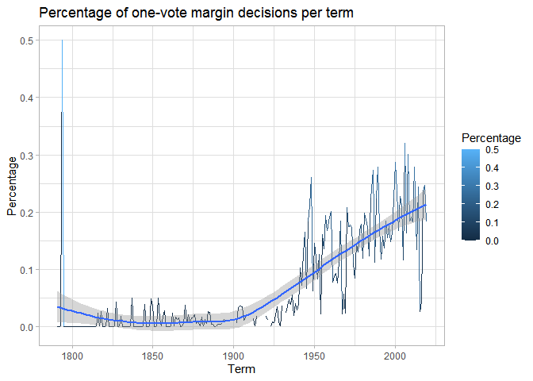

Exploring U.S. Supreme Court Decisions
================
Gustavo Arruda

## Get the data

``` r
# load useful packages
library(tidyverse)
```

    ## -- Attaching packages ---------------------------------------------------------- tidyverse 1.3.0 --

    ## v ggplot2 3.3.2     v purrr   0.3.4
    ## v tibble  3.0.3     v dplyr   1.0.2
    ## v tidyr   1.1.2     v stringr 1.4.0
    ## v readr   1.3.1     v forcats 0.5.0

    ## -- Conflicts ------------------------------------------------------------- tidyverse_conflicts() --
    ## x dplyr::filter() masks stats::filter()
    ## x dplyr::lag()    masks stats::lag()

``` r
# load data
case_data <- read_csv("data/scdb-case.csv")
```

    ## Parsed with column specification:
    ## cols(
    ##   .default = col_double(),
    ##   caseId = col_character(),
    ##   docketId = col_character(),
    ##   caseIssuesId = col_character(),
    ##   dateDecision = col_character(),
    ##   usCite = col_character(),
    ##   sctCite = col_logical(),
    ##   ledCite = col_character(),
    ##   lexisCite = col_character(),
    ##   chief = col_character(),
    ##   docket = col_logical(),
    ##   caseName = col_character(),
    ##   dateArgument = col_character(),
    ##   dateRearg = col_character(),
    ##   adminAction = col_logical(),
    ##   adminActionState = col_logical(),
    ##   lawMinor = col_character()
    ## )

    ## See spec(...) for full column specifications.

    ## Warning: 15270 parsing failures.
    ##   row     col           expected       actual                 file
    ## 19887 sctCite 1/0/T/F/TRUE/FALSE 67 S. Ct. 6  'data/scdb-case.csv'
    ## 19887 docket  1/0/T/F/TRUE/FALSE 24           'data/scdb-case.csv'
    ## 19888 sctCite 1/0/T/F/TRUE/FALSE 67 S. Ct. 13 'data/scdb-case.csv'
    ## 19888 docket  1/0/T/F/TRUE/FALSE 12           'data/scdb-case.csv'
    ## 19889 sctCite 1/0/T/F/TRUE/FALSE 67 S. Ct. 1  'data/scdb-case.csv'
    ## ..... ....... .................. ............ ....................
    ## See problems(...) for more details.

``` r
vote_data <- read_csv("data/scdb-vote.csv")
```

    ## Parsed with column specification:
    ## cols(
    ##   caseId = col_character(),
    ##   docketId = col_character(),
    ##   caseIssuesId = col_character(),
    ##   voteId = col_character(),
    ##   term = col_double(),
    ##   justice = col_double(),
    ##   justiceName = col_character(),
    ##   vote = col_double(),
    ##   opinion = col_double(),
    ##   direction = col_double(),
    ##   majority = col_double(),
    ##   firstAgreement = col_double(),
    ##   secondAgreement = col_double()
    ## )

## Recode variables as you find necessary

## What percentage of cases in each term are decided by a one-vote margin (i.e. 5-4, 4-3, etc.)

``` r
case_data %>%
  mutate(difference = majVotes - minVotes) %>%
  group_by(term) %>%
  summarize(one_vote_margin = sum(difference == "1") / n()) %>%
  ggplot() +
  geom_line(aes(x = term, y = one_vote_margin)) +
  labs(title = "Percentage of one-vote margin decisions per term", x = "Term", y = "Percentage")
```

    ## `summarise()` ungrouping output (override with `.groups` argument)

<!-- -->

## For justices [currently serving on the Supreme Court](https://www.supremecourt.gov/about/biographies.aspx), how often have they voted in the conservative direction in cases involving criminal procedure, civil rights, economic activity, and federal taxation?

Organize the resulting graph by justice in descending order of
seniority. (Note that the chief justice is always considered the most
senior member of the court, regardless of appointment date.)

## In each term, how many of the term’s published decisions (decided after oral arguments) were announced in a given month?

## Which justices are most likely to agree with with the Court’s declaration that an act of Congress, a state or territorial law, or a municipal ordinance is unconstitutional? Identify all cases where the Court declared something unconstitutional and determine the ten justices who most and least frequently agreed with this outcome as a percentage of all votes cast by the justice in these cases. Exclude any justice with fewer than 30 votes in cases where the Court’s outcome declares something unconstitutional.

## In each term he served on the Court, in what percentage of cases was Justice Antonin Scalia in the majority?

## Create a graph similar to above that adds a second component which compares the percentage for all cases versus non-unanimous cases (i.e. there was at least one dissenting vote)

## In each term, what percentage of cases were decided in the conservative direction?

## The Chief Justice is frequently seen as capable of influencing the ideological direction of the Court. Create a graph similar to the one above that also incorporates information on who was the Chief Justice during the term.

## Session info

``` r
devtools::session_info()
```

    ## - Session info ---------------------------------------------------------------
    ##  setting  value                       
    ##  version  R version 4.0.2 (2020-06-22)
    ##  os       Windows 8.1 x64             
    ##  system   x86_64, mingw32             
    ##  ui       RTerm                       
    ##  language (EN)                        
    ##  collate  English_United States.1252  
    ##  ctype    English_United States.1252  
    ##  tz       America/Chicago             
    ##  date     2020-10-19                  
    ## 
    ## - Packages -------------------------------------------------------------------
    ##  package     * version date       lib source        
    ##  assertthat    0.2.1   2019-03-21 [1] CRAN (R 4.0.2)
    ##  backports     1.1.10  2020-09-15 [1] CRAN (R 4.0.2)
    ##  blob          1.2.1   2020-01-20 [1] CRAN (R 4.0.2)
    ##  broom         0.7.0   2020-07-09 [1] CRAN (R 4.0.2)
    ##  callr         3.4.4   2020-09-07 [1] CRAN (R 4.0.2)
    ##  cellranger    1.1.0   2016-07-27 [1] CRAN (R 4.0.2)
    ##  cli           2.0.2   2020-02-28 [1] CRAN (R 4.0.2)
    ##  colorspace    1.4-1   2019-03-18 [1] CRAN (R 4.0.2)
    ##  crayon        1.3.4   2017-09-16 [1] CRAN (R 4.0.2)
    ##  DBI           1.1.0   2019-12-15 [1] CRAN (R 4.0.2)
    ##  dbplyr        1.4.4   2020-05-27 [1] CRAN (R 4.0.2)
    ##  desc          1.2.0   2018-05-01 [1] CRAN (R 4.0.2)
    ##  devtools      2.3.2   2020-09-18 [1] CRAN (R 4.0.2)
    ##  digest        0.6.25  2020-02-23 [1] CRAN (R 4.0.2)
    ##  dplyr       * 1.0.2   2020-08-18 [1] CRAN (R 4.0.2)
    ##  ellipsis      0.3.1   2020-05-15 [1] CRAN (R 4.0.2)
    ##  evaluate      0.14    2019-05-28 [1] CRAN (R 4.0.2)
    ##  fansi         0.4.1   2020-01-08 [1] CRAN (R 4.0.2)
    ##  farver        2.0.3   2020-01-16 [1] CRAN (R 4.0.2)
    ##  forcats     * 0.5.0   2020-03-01 [1] CRAN (R 4.0.2)
    ##  fs            1.5.0   2020-07-31 [1] CRAN (R 4.0.2)
    ##  generics      0.0.2   2018-11-29 [1] CRAN (R 4.0.2)
    ##  ggplot2     * 3.3.2   2020-06-19 [1] CRAN (R 4.0.2)
    ##  glue          1.4.2   2020-08-27 [1] CRAN (R 4.0.2)
    ##  gtable        0.3.0   2019-03-25 [1] CRAN (R 4.0.2)
    ##  haven         2.3.1   2020-06-01 [1] CRAN (R 4.0.2)
    ##  hms           0.5.3   2020-01-08 [1] CRAN (R 4.0.2)
    ##  htmltools     0.5.0   2020-06-16 [1] CRAN (R 4.0.2)
    ##  httr          1.4.2   2020-07-20 [1] CRAN (R 4.0.2)
    ##  jsonlite      1.7.1   2020-09-07 [1] CRAN (R 4.0.2)
    ##  knitr         1.30    2020-09-22 [1] CRAN (R 4.0.2)
    ##  labeling      0.3     2014-08-23 [1] CRAN (R 4.0.0)
    ##  lifecycle     0.2.0   2020-03-06 [1] CRAN (R 4.0.2)
    ##  lubridate     1.7.9   2020-06-08 [1] CRAN (R 4.0.2)
    ##  magrittr      1.5     2014-11-22 [1] CRAN (R 4.0.2)
    ##  memoise       1.1.0   2017-04-21 [1] CRAN (R 4.0.2)
    ##  modelr        0.1.8   2020-05-19 [1] CRAN (R 4.0.2)
    ##  munsell       0.5.0   2018-06-12 [1] CRAN (R 4.0.2)
    ##  pillar        1.4.6   2020-07-10 [1] CRAN (R 4.0.2)
    ##  pkgbuild      1.1.0   2020-07-13 [1] CRAN (R 4.0.2)
    ##  pkgconfig     2.0.3   2019-09-22 [1] CRAN (R 4.0.2)
    ##  pkgload       1.1.0   2020-05-29 [1] CRAN (R 4.0.2)
    ##  prettyunits   1.1.1   2020-01-24 [1] CRAN (R 4.0.2)
    ##  processx      3.4.4   2020-09-03 [1] CRAN (R 4.0.2)
    ##  ps            1.3.4   2020-08-11 [1] CRAN (R 4.0.2)
    ##  purrr       * 0.3.4   2020-04-17 [1] CRAN (R 4.0.2)
    ##  R6            2.4.1   2019-11-12 [1] CRAN (R 4.0.2)
    ##  Rcpp          1.0.5   2020-07-06 [1] CRAN (R 4.0.2)
    ##  readr       * 1.3.1   2018-12-21 [1] CRAN (R 4.0.2)
    ##  readxl        1.3.1   2019-03-13 [1] CRAN (R 4.0.2)
    ##  remotes       2.2.0   2020-07-21 [1] CRAN (R 4.0.2)
    ##  reprex        0.3.0   2019-05-16 [1] CRAN (R 4.0.2)
    ##  rlang         0.4.7   2020-07-09 [1] CRAN (R 4.0.2)
    ##  rmarkdown     2.4     2020-09-30 [1] CRAN (R 4.0.2)
    ##  rprojroot     1.3-2   2018-01-03 [1] CRAN (R 4.0.2)
    ##  rstudioapi    0.11    2020-02-07 [1] CRAN (R 4.0.2)
    ##  rvest         0.3.6   2020-07-25 [1] CRAN (R 4.0.2)
    ##  scales        1.1.1   2020-05-11 [1] CRAN (R 4.0.2)
    ##  sessioninfo   1.1.1   2018-11-05 [1] CRAN (R 4.0.2)
    ##  stringi       1.5.3   2020-09-09 [1] CRAN (R 4.0.2)
    ##  stringr     * 1.4.0   2019-02-10 [1] CRAN (R 4.0.2)
    ##  testthat      2.3.2   2020-03-02 [1] CRAN (R 4.0.2)
    ##  tibble      * 3.0.3   2020-07-10 [1] CRAN (R 4.0.2)
    ##  tidyr       * 1.1.2   2020-08-27 [1] CRAN (R 4.0.2)
    ##  tidyselect    1.1.0   2020-05-11 [1] CRAN (R 4.0.2)
    ##  tidyverse   * 1.3.0   2019-11-21 [1] CRAN (R 4.0.2)
    ##  usethis       1.6.3   2020-09-17 [1] CRAN (R 4.0.2)
    ##  vctrs         0.3.4   2020-08-29 [1] CRAN (R 4.0.2)
    ##  withr         2.3.0   2020-09-22 [1] CRAN (R 4.0.2)
    ##  xfun          0.17    2020-09-09 [1] CRAN (R 4.0.2)
    ##  xml2          1.3.2   2020-04-23 [1] CRAN (R 4.0.2)
    ##  yaml          2.2.1   2020-02-01 [1] CRAN (R 4.0.2)
    ## 
    ## [1] C:/Users/Gustavo/OneDrive - The University of Chicago/Documents/R/win-library/4.0
    ## [2] C:/Program Files/R/R-4.0.2/library
